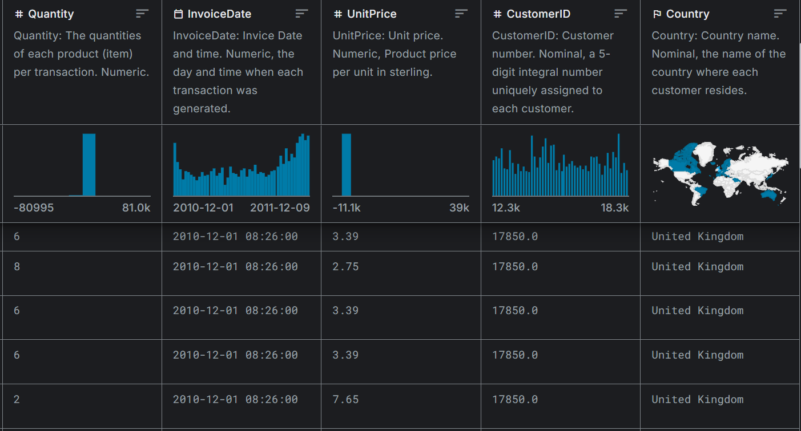
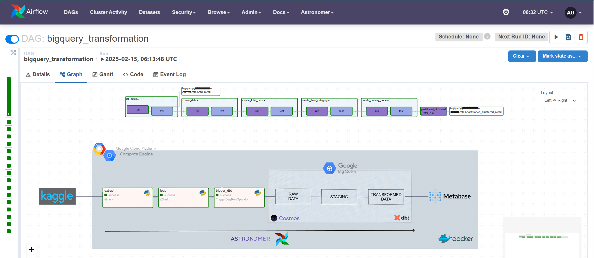
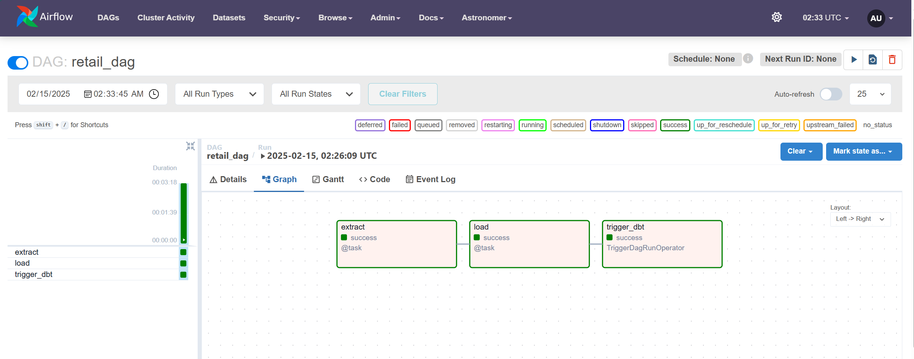
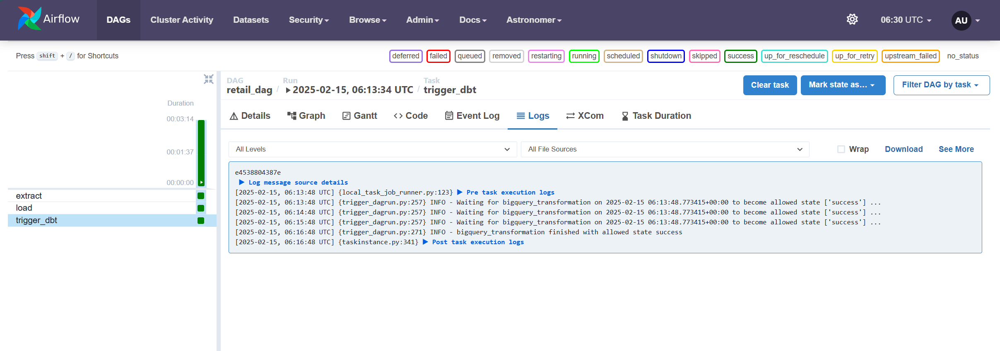
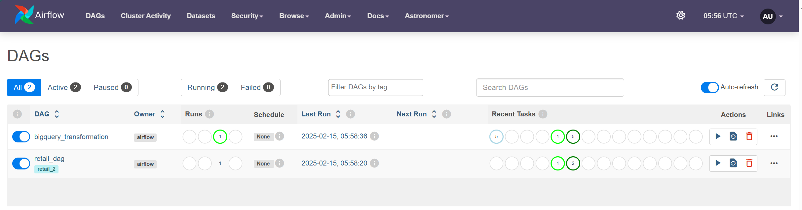
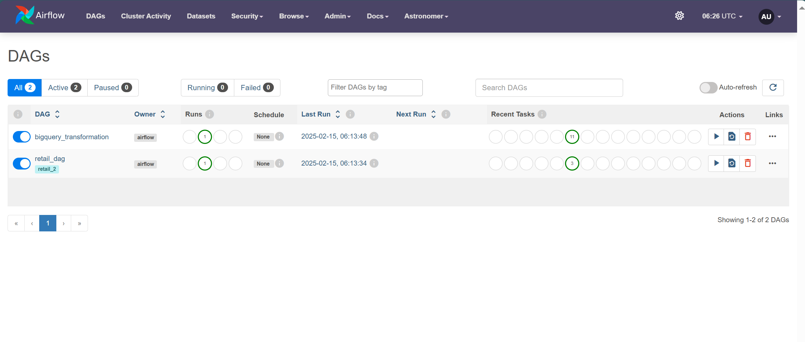
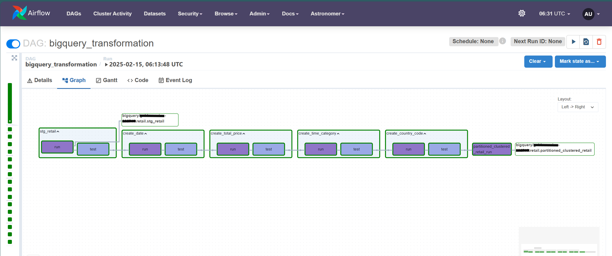
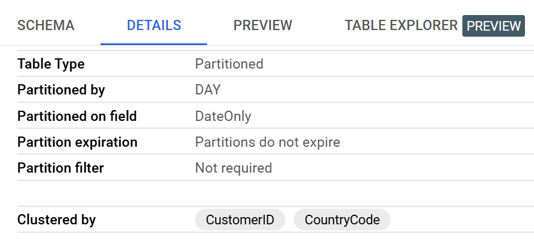
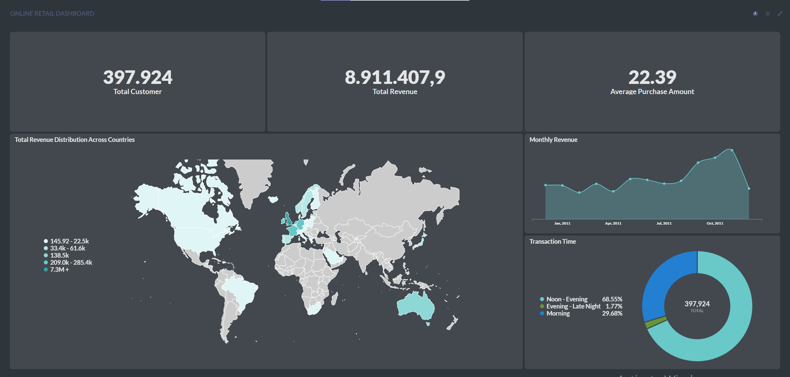

Overview
========

This project implements an end-to-end ELT pipeline using dbt, Apache Airflow, and Metabase on a GCP VM, with Astro Cosmos facilitating seamless dbt-Airflow integration. Raw retail data is extracted, load, cleaned, and transformed in BigQuery, where filtering removes invalid records, new features like total transaction values, country code, date, and time-based categorizations are created, and performance is optimized through partitioning and clustering. Workflow orchestration is managed by Apache Airflow, with Astronomer simplifying deployment, while all components—including Airflow, dbt, and Metabase—run within Docker containers for a scalable and reproducible environment. Metabase provides interactive data visualization, enabling deeper insights into customer transactions, while Docker Compose ensures smooth containerized execution across the entire pipeline.

Project Contents
================

Project contains the following files and folders:

- **`dags`**: Contains Python files for Airflow DAGs.  
- **`Dockerfile`**: Defines a versioned Astro Runtime Docker image along with other necessary commands.  
- **`dbt`**: Stores queries for dbt transformations.  
- **`include`**: Contains additional files required for the project.  
- **`docker-compose.override`**: Used to add extra containers to the setup.  
- **`requirements.txt`**: Lists Python packages needed for the project, allowing easy installation.  
- **`airflow_settings.yaml`**: A local-only file for configuring Airflow connections, variables, and pools.

Problem Statements
==================
1. The raw retail dataset contains inconsistencies, including null customer IDs and canceled transactions, making it difficult to analyze customer behavior accurately.  
2. The dataset lacks key derived features such as total transaction value, time-based categorization, and standardized country codes, which are essential for meaningful insights.  
3. Query performance is inefficient due to the large volume of data, requiring optimization through partitioning and clustering.  
4. There is no structured workflow to automate data transformation, validation, and visualization, leading to inefficiencies in data processing and decision-making.

Dataset Overview
================

This dataset captures transactional records from a UK-based online retail business between December 1, 2010, and December 9, 2011. 

| Column       | Description                                                    | Type    |
|-------------|----------------------------------------------------------------|--------|
| **InvoiceNo**  | Invoice number (6-digit integral). If starts with 'C', it's a cancellation. | Nominal |
| **StockCode**  | Product (item) code (5-digit integral). Uniquely assigned to each product. | Nominal |
| **Description** | Product (item) name. | Nominal |
| **Quantity**    | The quantity of each product per transaction. | Numeric |
| **InvoiceDate** | Invoice date and time when the transaction was generated. | Numeric |
| **UnitPrice**   | Price per unit in sterling. | Numeric |
| **CustomerID**  | Customer number (5-digit integral). Uniquely assigned to each customer. | Nominal |
| **Country**     | Country where the customer resides. | Nominal |

---
**First Five Rows:**



Data Pipeline
==============


ELT Processes
=============

This project follows an ELT workflow using dbt, transforming raw retail data into a structured and optimized format in BigQuery. The key steps include data filtering, transformation, testing, and optimization through partitioning and clustering.

1. Data Extraction and Load

    * Source Data: The raw dataset is extracted from kaggle website, unzipped, change to be DataFrame format.
    * Load Data: Load data to Google BigQuery using `to_gbq`
    

2. Trigger dbt DAG

    Trigger dbt using `TriggerDagRunOperator`.
    

    Because I set `wait_for_completion=True` (which waits for the DAG run to complete), the status of `retail_dag` will remain "running" if it has not yet completed.

    

    2 DAGs have been completed:
    

3. Data  Filtering (staging layer)

    * Filtering in stg_retail.sql:
        * Only includes records where CustomerID is not null.
        * Excludes canceled transactions (InvoiceNo not starting with 'C').
        * Converts product descriptions to lowercase for consistency.

4. Transformation (dbt models)

    * `stg_retail`: Creates a staging table with cleaned and structured raw data.
    * `create_date`: Extracts only the date from InvoiceDate.
    * `create_total_price`: Calculates total transaction value (Quantity * UnitPrice).
    * `create_time_category`: Categorizes transactions into time periods (Dawn, Morning, Afternoon, Evening, Night).
    * `create_country_code`: Converts country names into ISO-3166 alpha-2 country codes.

3. Testing and Validation (schema.yml)

    * Ensures data integrity by applying not_null tests to critical fields (InvoiceNo, StockCode, ProductName, Quantity, etc.).
    * Validates transformation outputs (e.g., TotalPrice, TimeCategory, CountryCode) to ensure no null values.

    Transformation in Google BigQuery and Testing
    

4. Optimization (Partitioning & Clustering)
    * Partitioning: The transformed dataset is partitioned by InvoiceDate to improve query performance.
    * Clustering: Optimized by clustering on CountryCode to enable efficient filtering and aggregations.
    

5. Visualize the data using Metabase.
    


Prepare Google Cloud Platform:
=============================
1. Create a GCP project, example `project_id = 'capstone-project'`.
2. Create a service account in the project, grant it the permissions:
    * BigQuery Admin
    * You can include more permissions if you want to expand this project for a future use.
3. Create an access key JSON file and download the private key file.
4. Create VM Instance:
    * Navigate to Compute Engine > VM instances.
    * Click Create Instance.
    * Under the "Identity and API access" section, assign the service account you just created to the VM.
    * Configure other VM settings as required, and click Create.

Before Running the Project, Make Sure:  
======================================
1. Allow TCP ports 8080 and 3000 in your firewall settings.  
2. Install Docker and Docker Compose on your machine.  
3. Familiar with Linux enviroment.
4. Understand how to use Astronomer for Airflow deployment.  
5. Be familiar with dbt for data transformation.  
6. Have Python and pip installed to manage dependencies.  
7. Ensure your machine meets the system requirements for running multiple containers.  
8. Verify your Google Cloud credentials if using BigQuery or other GCP services.

Deploy Project
===========================

1. Setup VM GCP
    ```
    # SSH into VM on Git Bash
    cd ~/.ssh
    ssh-keygen -t rsa -f ~/.ssh/gcp -C <username> -b 2048

    # then, go to VM GCP -> settings -> enter the public key in SSH Keys metadata.

    # connecting to the server on Git Bash
    ssh -i ~/.ssh/gcp <username>@<external IP>
    ```

2. Create an Enviroment File

    Create an `.env` file and fill this:
    ```dotenv
    PROJECT_ID='<gcp project id>'
    FILE_URL='<url to dataset>'
    ```

1. Start Airflow on your virtual machine GCP by running:
    ```
    astro dev start
    ```

    This command will spin up 4 Docker containers on your machine, each for a different Airflow component:

    - Postgres: Airflow's Metadata Database
    - Webserver: The Airflow component responsible for rendering the Airflow UI
    - Scheduler: The Airflow component responsible for monitoring and triggering tasks
    - Triggerer: The Airflow component responsible for triggering deferred tasks
    - Metabase: Provides data visualization.

    Verify running containers with:
    ```
    docker ps
    ```

2. Access the Airflow UI for your local Airflow project. To do so, go to `http://</external ip>:8080/` and log in with 'admin' for both your Username and Password.

    * You should also be able to access your Postgres Database at `</external ip>:5432/postgres`.
    * Access your Metabase at `</external ip>:3000`.


Learn More  
==========
- What is [ELT](https://www.ibm.com/think/topics/elt)?
- Introduction to [Google BigQuery](https://cloud.google.com/bigquery?hl=en)  
- Understanding [Google Compute Engine Instances](https://cloud.google.com/compute/docs/instances/)  
- Learn more about [dbt](https://docs.getdbt.com/docs/build/documentation)
- What is [Astronomer](https://www.astronomer.io/)?
- Get familiar with [Apache Airflow](https://airflow.apache.org/docs/)
- Introduction to [Metabase](https://www.metabase.com/docs/latest/)